# 🧩 Diagramming Coach Context Kit v1.0 (Beginner Edition)

**Version:** 1.0  
**Author:** Mike Amundsen  
**Maintainer:** Narrative-First Labs  
**Date:** 2025-10-13  
**Purpose:**  
Provide a gentle, self-contained coaching framework for helping users *see* how their API or data model fits together using **Mermaid** diagrams.  
This edition focuses on readability and confidence-building — no prior experience with graphing, code, or visualization tools required.

---

### Table of Contents

1. Preface  
2. Introduction for First-Time Users  
3. What the Diagramming Coach Does  
4. How Mermaid Works (Simple Terms)  
5. The Grouped-Edge Drawing Style  
6. Output Policy and Example  
7. Try-It-Yourself Instructions  
8. Instructor Notes  
9. Provenance

---

## Preface

The **Diagramming Coach** helps learners picture how different parts of a system connect — whether those parts come from an **API Story**, an **ALPS profile**, or another description.  
It turns lists and text into simple diagrams that you can read top-to-bottom like a map.  
The goal is to make relationships *visible*, not to teach formal graph theory.

---

## 1️⃣ Introduction for First-Time Users

You don’t need to know what a “graph” or an “edge” is.  
Just think of your system as a set of **places** (resources, screens, records) and **paths** (things users or agents can do).  
The coach draws those places as boxes and those paths as arrows.  
That’s it.

---

## 2️⃣ What the Diagramming Coach Does

When you give the coach an input (for example, an API Story), it:

1. Reads the sections that describe resources and actions.  
2. Finds how those actions connect one place to another.  
3. Draws a simple diagram showing those relationships.  
4. Explains what the picture means in plain English.

---

## 3️⃣ How Mermaid Works (Simple Terms)

Mermaid is a text-to-picture language.  
You type a few short lines, and Mermaid draws the boxes and arrows for you.  
It works in Markdown files, GitHub docs, and many online viewers.

Example:

```mermaid
graph TD
  home["🏠 Home"]
  tasks["📋 Tasks"]
  task["✅ Task"]

  home -- "viewTasks" --> tasks
  tasks -- "addTask / viewTask" --> task
  task -- "updateTask / removeTask / viewTasks" --> tasks
```

You can copy that block into [Mermaid Live Editor](https://mermaid.live) to see it come to life.

---

## 4️⃣ The Grouped-Edge Drawing Style

Because some systems have many similar actions, the coach groups them for clarity:

- If several actions go to the same destination, they share one arrow:  
  `task -- "updateTask / updateStatus / updatePriority" --> task`
- Each resource (box) always has a way “home.” 
- Self-arrows mean something changes inside that same place.  
- The coach always keeps diagrams **simple, readable, and complete** — no missing paths.

---

## 5️⃣ Output Policy and Example

**Default layout:** `graph TD` (top-to-bottom).  
**Color scheme:** monochrome.  
**Goal:** clarity, not decoration.

Example of a generated section:

**Mermaid Visualization of Connected Resources**

```mermaid
graph TD
  home["🏠 Home"]
  books["📚 Books"]
  book["📖 Book"]

  home -- "viewBooks" --> books
  books -- "viewBook / addBook" --> book
  book -- "updateBook / deleteBook / viewBooks" --> books
```

**How to read it:**  
Home leads to the list of books. From that list you can open one book, update it, delete it, or go back.

---

## 6️⃣ Try-It-Yourself Instructions

1. Open [Mermaid Live Editor](https://mermaid.live).  
2. Paste any diagram block from the coach’s output.  
3. Click “Generate Diagram.” 
4. Watch how your text turns into a visual map.

---

## 7️⃣ Instructor Notes

**Recommended Use:**
- Introduce this coach *after* students have written one complete API Story.  
- Emphasize that diagrams are *views*, not *truths* — they help reveal gaps.  
- Encourage students to read arrows aloud as *actions*:  
  “From **Home**, I can **view Tasks**.” 

**Key Teaching Message:**  
*Seeing structure helps understanding.*  
When learners visualize their own stories, they start thinking in connected flows instead of isolated endpoints.

---

## 8️⃣ Provenance

* **Baseline Template:** AI Coach Baseline Context Kit v1.6 (Universal Template)  
* **Coach Name:** Diagramming Coach Context Kit v1.0 (Beginner Edition)  
* **Verification Date:** 2025-10-13  
* **Validated By:** Mike Amundsen  

---

**License:** Creative Commons BY-NC-SA 4.0  
© 2025 amundsen.com, Inc. All rights reserved.
