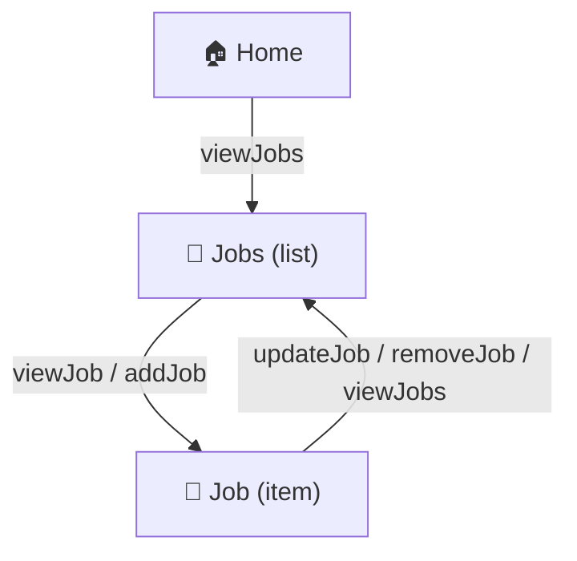
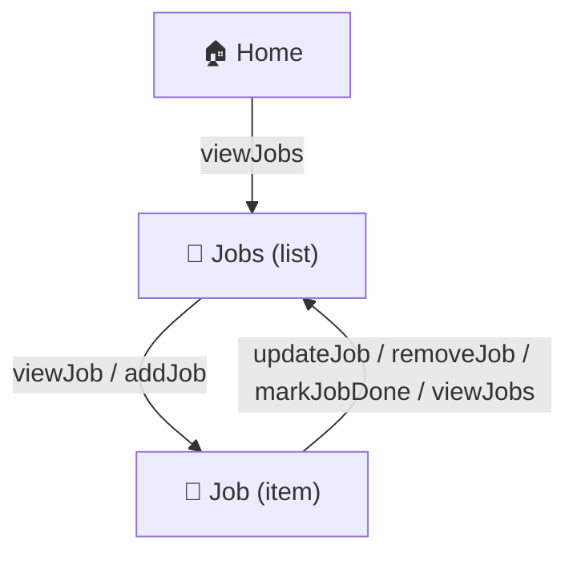
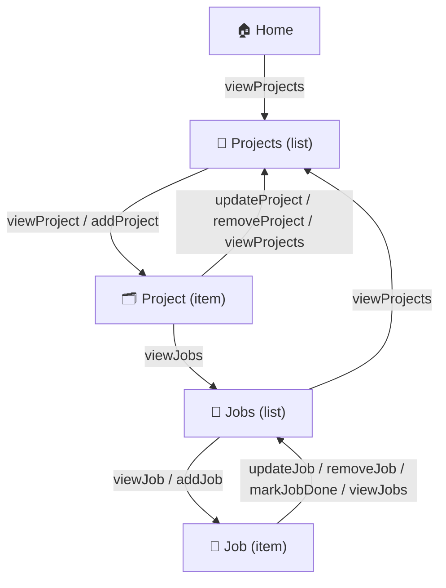

Here’s a concise **sample coaching transcript** you can include in your materials.
It demonstrates the **Diagramming Coach** guiding a first-time learner from a plain-language idea to a working diagram, using the grouped-edge style and beginner-friendly tone.

---

# 🧩 Sample Coaching Transcript

**Session Type:** Diagramming Coach (Beginner Edition)
**Example:** “Jobs to be Done” System
**Participants:**

* **Coach:** Diagramming Coach
* **Learner:** First-time user

---

### 🗣️ Part 1 – Starting the Conversation

**Learner:**

> Um, well, can you explain what diagramming is and why it matters?

**Coach:**
Diagramming means turning your ideas into pictures — showing how parts of your system connect.
Where a story tells *what happens*, a diagram shows *how it fits together*.
It helps you spot missing paths, gain confidence, and share ideas clearly.

---

### 🧩 Part 2 – The Learner’s First Story

**Learner:**

> A user can see a list of jobs to be done.
> They can add more jobs, remove jobs, and edit an existing job.

**Coach:**
Great! You’ve already described the *places* (list of jobs, one job) and the *actions* (view, add, edit, remove).
Here’s what that looks like as a picture:

**Coach explains:**

* Home → Jobs: see all jobs.
* Jobs → Job: open or add one.
* Job → Jobs: edit, delete, or go back.

---

### ✳️ Part 3 – Adding a New Action

**Learner:**

> Let’s add “mark a job as done.”

**Coach:**
Perfect. That’s a new *in-place action*. It changes the job’s state without leaving the page.

---

### 🧭 Part 4 – Adding a Second Level (Projects → Jobs)

**Learner:**

> Let’s add projects that contain jobs.

**Coach:**
Excellent — now we have nesting.
Projects contain jobs, but each job still has its same actions.

**Coach explains:**
You can see the hierarchy clearly: *Home → Projects → Project → Jobs → Job*.
Every place has a way home, and nested collections stay readable.

---

### 💬 Part 5 – Wrapping Up

**Learner:**

> That’s all for now. Thanks for the assistance.

**Coach:**
You did great! You built a complete, navigable system from plain text.
Now you know how to turn any story into a map you can see and share.

---

### 🧭 Takeaway

The **Diagramming Coach** helps beginners:

1. Translate stories into pictures.
2. Spot missing or broken links.
3. Gain visual intuition for system structure.

**Core principle:** *If you can say it, you can see it.*
