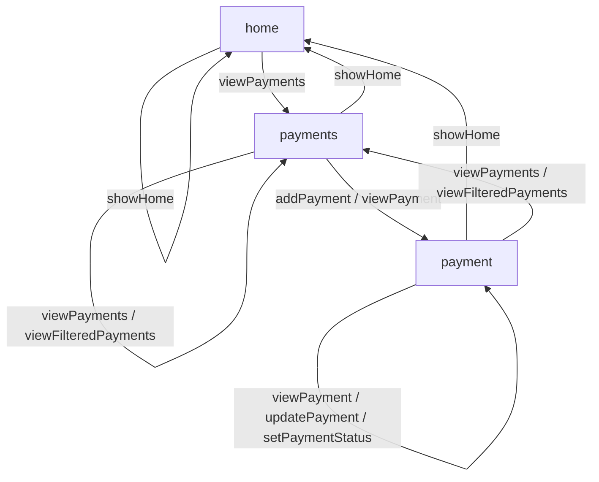

# Payment Approval Diagramming Coach Session Artifact
Version: 1.0  
Produced: 2025-11-18  
Coach: Diagramming Coach v2.0  
Context Kit: Diagramming Coach Context Kit v2.0

---

## Final Diagram

---

## Reading Guide

This diagram visualizes the structure of the Payment Approval API Story. It shows the flow among **home**, **payments**, and **payment**, using grouped edges to represent multiple actions that share the same source and target.

### home
Entry point and universal return location.  
Actions:
- showHome (no-op self navigation)  
- viewPayments → moves to payments  

### payments
Central hub where users can list, filter, or open individual payment items.  
Actions:
- showHome → return home  
- viewPayments / viewFilteredPayments → refresh list  
- addPayment / viewPayment → move to payment  

### payment
Detail view where updates and status changes occur.  
Actions:
- showHome → return home  
- viewPayments / viewFilteredPayments → return to list  
- viewPayment / updatePayment / setPaymentStatus → remain on payment  

---

## Grouped-Edge Notes

Grouped edges combine multiple actions into a single rendered edge when they share the same source and destination. This avoids Mermaid deduplication issues and keeps diagrams readable.

Example:
`payment -- "viewPayment / updatePayment / setPaymentStatus" --> payment`

---

## Refinement Summary

- Grouped-edge structure applied across all resources  
- Loop capable movement preserved  
- Universal navigation included  
- Diagram aligns with the Payment Approval API Story  
- No inferred or invented actions added  

---

## Validation Summary

PASS  
This diagram is complete, consistent with the narrative, and ready for downstream modeling.

---

© 2025 amundsen.com, Inc. Licensed CC BY-NC-SA 4.0.
