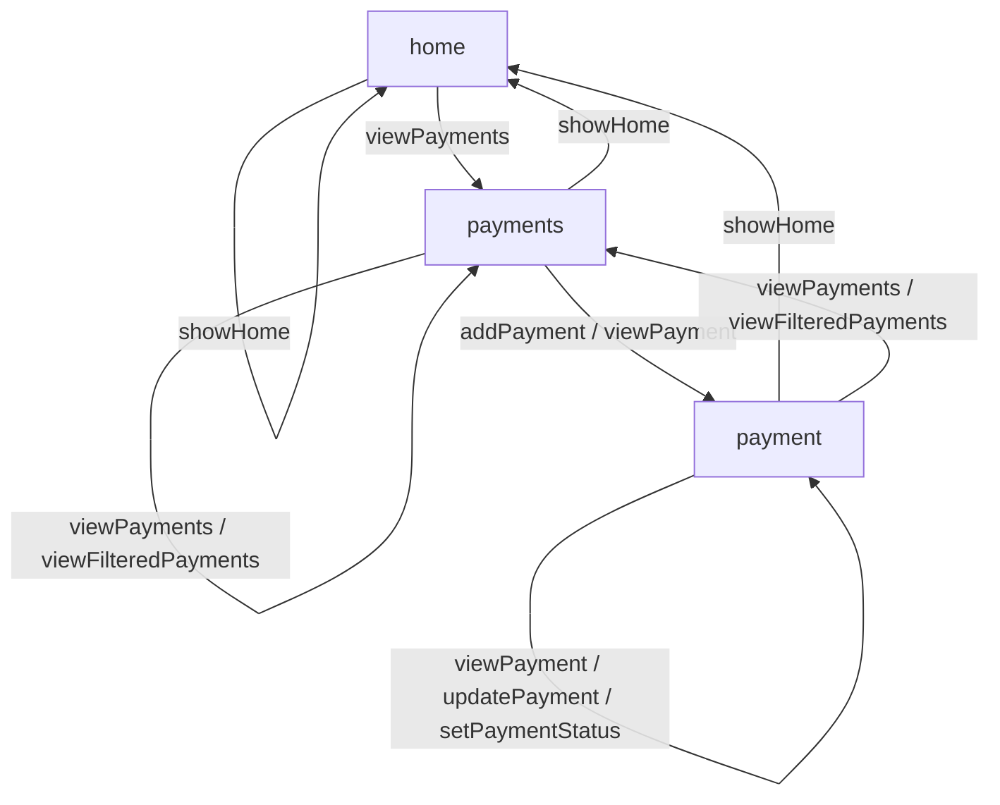

# Payment Approval API - Diagramming Session

**Session Date:** 2025-11-18  
**Domain:** Payment Approval  
**Coach:** Diagramming Coach v2.1  
**Rendering Standard:** Grouped-edge rendering

---

## Session Overview

This session converted the Payment Approval API Story into a clean Mermaid diagram using grouped-edge rendering to maintain readability and avoid path deduplication.

---

## Final Diagram



---

## Reading Guide

### Navigation Patterns

**Entry and Exit:**
- Start at `home`, the initial entry point for the API
- Navigate to `payments` to see the collection of payment requests
- From `payments`, drill into individual `payment` records
- From any place, return to `home` via `showHome` action

**Flow Structure:**
- **Home → Payments → Payment** creates a logical drill-down pattern
- Bidirectional navigation between all three places
- Hub-and-spoke design with `home` as the central anchor

### Self-Loop Operations

**home:**
- `showHome` - refresh/reload the home resource

**payments:**
- `viewPayments` - display the list of payment requests
- `viewFilteredPayments` - display filtered subset of payments

**payment:**
- `viewPayment` - display single payment record (read-only)
- `updatePayment` - modify payment details (write)
- `setPaymentStatus` - change approval status (write)

---

## Grouped-Edge Notes

### What is Grouped-Edge Rendering?

Grouped-edge rendering combines multiple actions that share the same source and target into a single diagram edge. This prevents Mermaid's automatic path deduplication and keeps diagrams readable.

### Grouped Edges in This Diagram

1. **payments → payments**
   - Actions: `viewPayments / viewFilteredPayments`
   - Both are read operations on the collection
   - Grouping appropriate as they share similar intent

2. **payments → payment**
   - Actions: `addPayment / viewPayment`
   - Different operations (create vs. read) but same destination
   - Grouping keeps navigation clear

3. **payment → payment**
   - Actions: `viewPayment / updatePayment / setPaymentStatus`
   - Mixed read/write operations
   - Note: This masks that viewing is read-only while others modify state
   - Grouping preserves readability

4. **payment → payments**
   - Actions: `viewPayments / viewFilteredPayments`
   - Navigation back to collection with optional filtering
   - Grouping appropriate as both return to the payments list

### When to Consider Ungrouping

Grouped edges may be expanded into individual transitions when:
- Distinguishing read vs. write operations is critical
- Security or authorization policies differ between actions
- Error handling or validation rules vary significantly
- Stakeholders need to see each action path explicitly

For this session, all grouped edges were accepted as appropriate for the diagram's purpose.

---

## Structural Observations

### Patterns Identified

**Hub Navigation:**
- Every place can return to `home` via `showHome`
- Creates a consistent escape route throughout the API
- Supports user orientation and error recovery

**Bidirectional Flow:**
- `home` ↔ `payments` ↔ `payment` creates logical drill-down
- Users can navigate both forward (deeper) and backward (higher level)
- No dead-end states

**Self-Loops:**
- Each place has actions that loop back to itself
- Supports both read operations (viewing) and write operations (updating)
- Enables repeated actions without navigation overhead

**Collection vs. Item:**
- `payments` handles collection-level operations (list, filter, add)
- `payment` handles item-level operations (view, update, status change)
- Clear separation of concerns

### Key Insights

1. **State changes only at item level**: All modifications (update, setStatus) happen at the `payment` resource, not at `payments`
2. **Filtering returns to collection**: `viewFilteredPayments` from `payment` navigates back to `payments`, maintaining collection context
3. **No orphaned resources**: Every place is reachable from `home` within two hops
4. **Symmetric navigation**: Most forward paths have corresponding backward paths

---

## Refinement Summary

**Changes Requested:** None

**Rationale:**
- Initial structure accurately represented the API Story
- Grouped edges appropriately balanced readability with detail
- Flow patterns matched expected system behavior
- No missing or extraneous actions identified

**Accepted Structure:**
- 3 places (home, payments, payment)
- 11 actions across 8 grouped edges
- Top-to-bottom readability maintained
- All transitions from original API Story preserved

---

## Validation Summary

### Validation Checklist

✅ **All places appear**
   - home
   - payments
   - payment

✅ **All actions have destinations**
   - Every action in the API Story maps to a valid transition

✅ **Grouped-edge rendering applied**
   - All shared source/target pairs combined on single edges
   - Syntax: `source -- "action1 / action2 / action3" --> target`

✅ **No duplicate paths exist**
   - Each unique source-target pair appears exactly once
   - Mermaid path deduplication avoided

✅ **Top-to-bottom readability preserved**
   - Diagram flows logically from entry (home) to collections to items
   - No circular visual tangles

✅ **No invented actions**
   - All actions sourced directly from API Story
   - No assumptions or additions made

### Validation Status: PASS ✓

This diagram accurately represents the Payment Approval API Story and conforms to grouped-edge rendering standards.

---

## Source API Story Reference

### Resources and Actions

**home**
- showHome → home
- viewPayments → payments

**payments**
- showHome → home
- viewPayments → payments
- addPayment → payment
- viewPayment → payment
- viewFilteredPayments → payments

**payment**
- showHome → home
- viewPayments → payments
- viewPayment → payment
- updatePayment → payment
- setPaymentStatus → payment
- viewFilteredPayments → payments

### Data Properties

- id, amount, currencyType, payee, invoice, comments
- requestor, reviewer, status
- dateDue, dateRequested, dateReviewed

### Key Rules

- requiredAmount, requiredCurrencyType, requiredPayee
- positiveAmount, validCurrencyType, validStatusValues
- reviewerRequiredForStatusChange
- onlyPendingCanBeApproved
- noEditingAfterApproval

---

## Next Steps

### Recommended Follow-Up Activities

1. **Vocabulary Analysis**
   - Identify shared vocabulary across actions and properties
   - Document domain language and terminology
   - Build glossary for development team

2. **ALPS Profile Creation**
   - Use ALPS Coach to create semantic profile
   - Map actions to HTTP methods
   - Define semantic descriptors for all properties

3. **Security Design**
   - Review grouped edges for authorization implications
   - Consider role-based access for updatePayment vs. viewPayment
   - Design approval workflow security (setPaymentStatus)

4. **Stakeholder Review**
   - Share diagram with product owners and developers
   - Validate workflow matches business requirements
   - Confirm navigation patterns support user needs

5. **API Documentation**
   - Include diagram in API documentation
   - Use as visual reference for onboarding
   - Link to OpenAPI/AsyncAPI specifications

### Integration Points

This diagram supports:
- OpenAPI specification generation
- AsyncAPI event modeling
- GraphQL schema design
- API testing strategy
- User experience flow mapping

---

## Provenance

**Generated by:** Diagramming Coach v2.1  
**Based on:** AI Coach Baseline Context Kit v2.0  
**Rendering Standard:** Grouped-edge rendering (mandatory)  
**Source Material:** Payment Approval API Story v1.0  
**Session Completed:** 2025-11-18

**License:** CC BY NC SA 4.0  
**© 2025** amundsen.com, Inc.

---

## Appendix: Grouped-Edge Rendering Reference

### Syntax

```mermaid
source -- "action1 / action2 / action3" --> target
```

### Benefits

- Avoids Mermaid's automatic path deduplication
- Maintains all action information in diagram
- Improves readability for complex APIs
- Preserves semantic relationships

### When to Use

- APIs with multiple actions between same resources
- Workflows with repeated transitions
- State machines with multiple triggers
- Navigation diagrams with parallel paths

### Alternative Approaches

If ungrouping is needed:
```mermaid
source -- "action1" --> target
source -- "action2" --> target
source -- "action3" --> target
```

Note: Mermaid may visually merge these paths, losing information.

---

**End of Session Artifact**
